# Deep Q-Network (DQN) アーキテクチャと仕組み

## 1. 全体システムアーキテクチャ

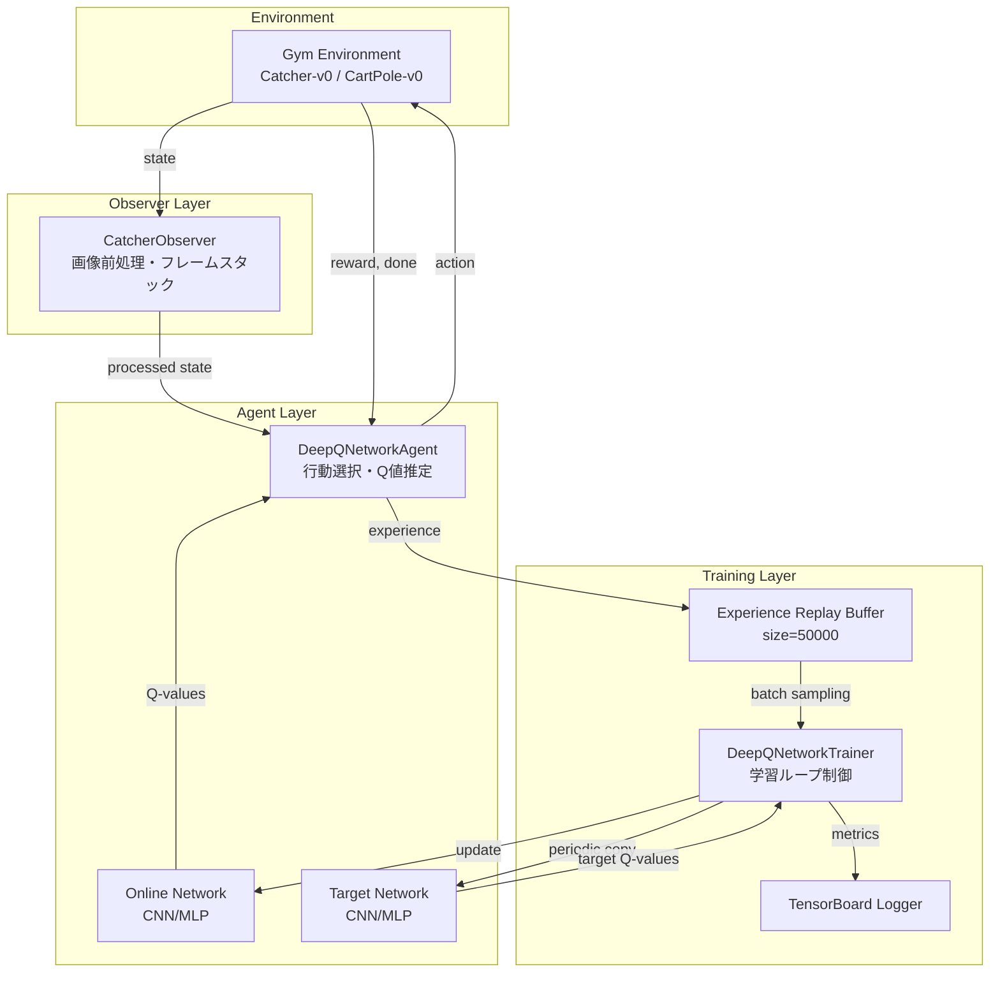

## 2. DQNアルゴリズムのフロー

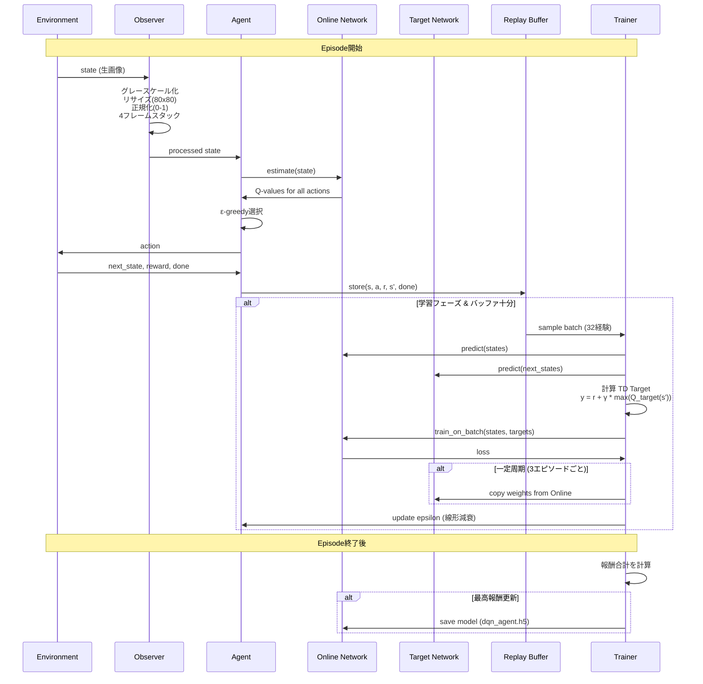

## 3. ニューラルネットワーク構造

### 3.1 Catcher用CNN (DeepQNetworkAgent)

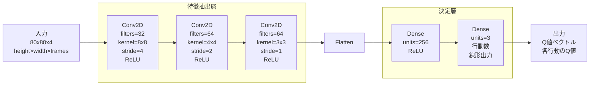

### 3.2 CartPole用MLP (DeepQNetworkAgentTest)

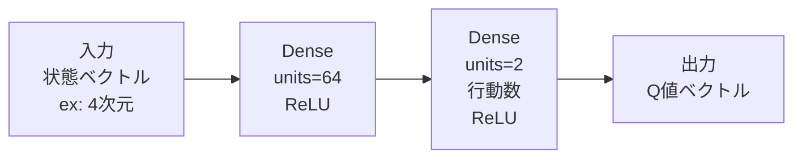

## 4. Experience Replay Buffer

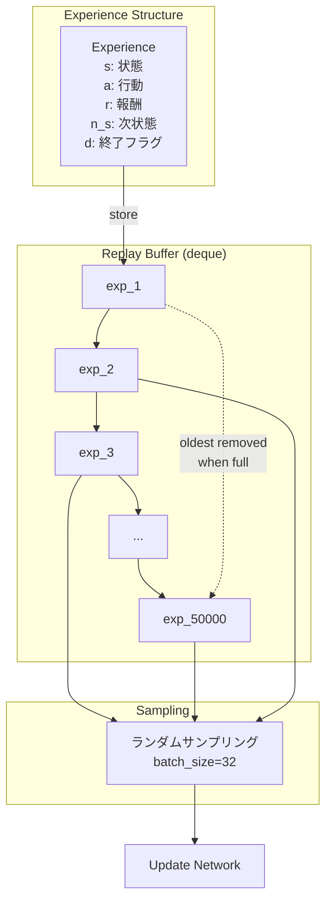

## 5. Q学習の更新メカニズム

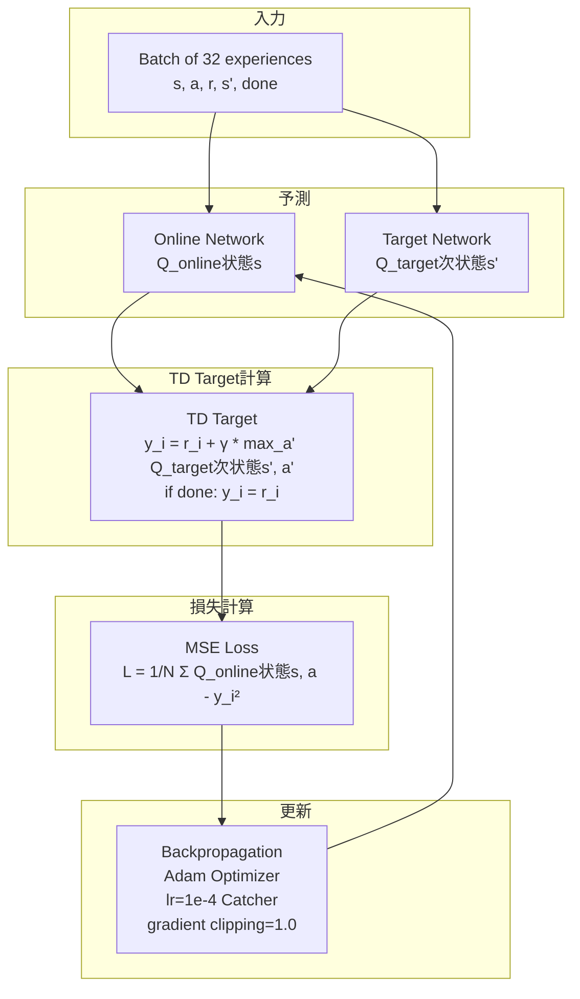

## 6. ε-greedy探索戦略

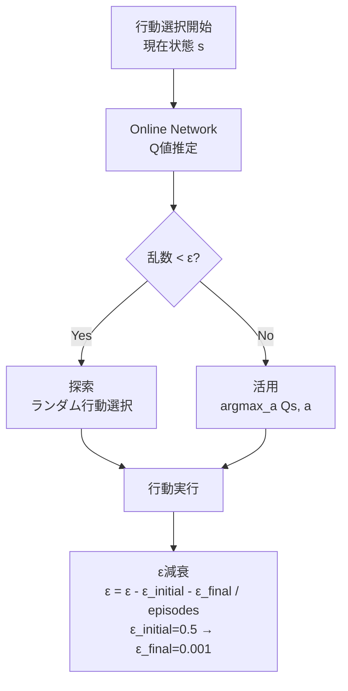

## 7. Target Network更新メカニズム

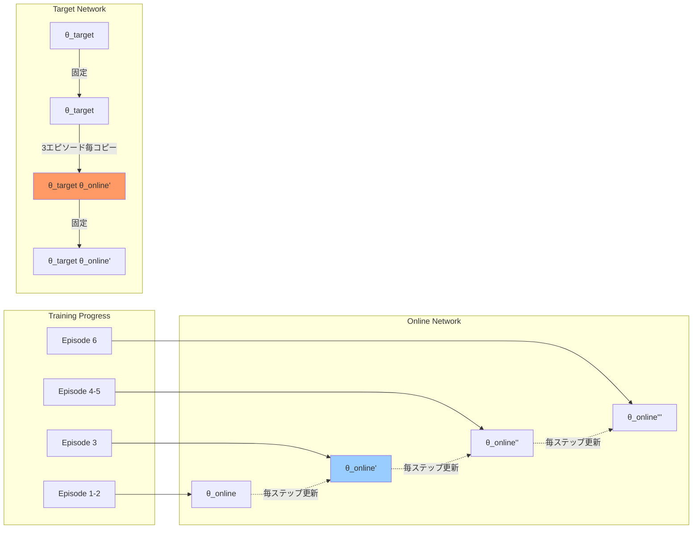

## 8. 学習パラメータと設定

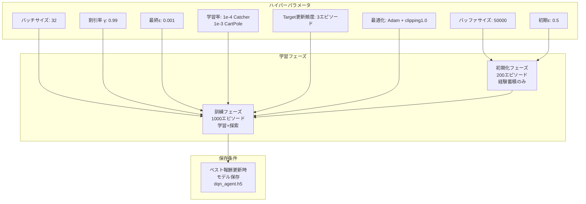

## 9. CatcherObserver前処理パイプライン

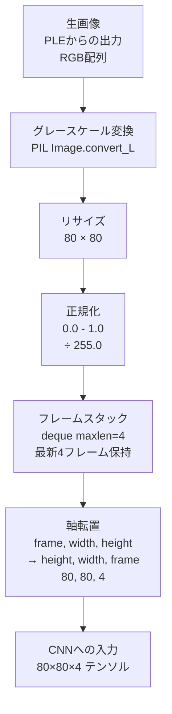

## 10. 強化学習としての成立要素

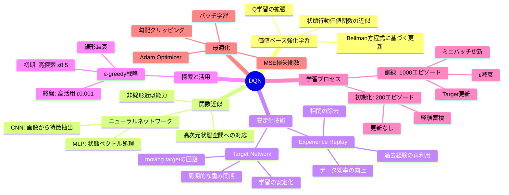

## 11. DQNが強化学習として成り立つ理由

### 11.1 マルコフ決定過程 (MDP) の要素

| MDP要素 | DQN実装 |
|---------|---------|
| **状態 S** | Catcher: 80×80×4画像テンソル<br/>CartPole: 4次元状態ベクトル |
| **行動 A** | Catcher: 3行動 (左/停止/右)<br/>CartPole: 2行動 (左/右) |
| **報酬 R** | 環境から各ステップで返される即時報酬 |
| **状態遷移 P** | 環境のstep関数により決定論的/確率的に遷移 |
| **割引率 γ** | 0.99 (未来報酬の重み付け) |
| **方策 π** | ε-greedy方策 (Q値最大化 + ランダム探索) |

### 11.2 Q学習の実装

**Bellman最適方程式:**
```
Q*(s, a) = E[r + γ * max_a' Q*(s', a')]
```

**DQNでの近似:**
```python
# update() メソッド内 (lines 94-110)
reward = e.r
if not e.d:
    reward += gamma * np.max(future[i])  # γ * max Q_target(s', a')
estimateds[i][e.a] = reward  # TD target
loss = model.train_on_batch(states, estimateds)  # MSE最小化
```

### 11.3 時間的差分 (TD) 学習

- **TD誤差**: `δ = [r + γ * max Q_target(s', a')] - Q_online(s, a)`
- **MSE損失**: `L = δ²`
- **勾配降下**: Adam optimizerによる重み更新

### 11.4 off-policy学習

- 経験再生バッファから過去の経験をサンプリング
- 現在の方策とは異なる過去の方策で得た経験から学習可能
- データ効率の向上とサンプル相関の除去

## まとめ

このDQN実装は以下の要素により強化学習として成立しています:

1. **価値関数近似**: Q値をニューラルネットで近似
2. **TD学習**: Bellman方程式に基づく逐次更新
3. **探索と活用のバランス**: ε-greedy戦略
4. **安定化技術**: Experience Replay + Target Network
5. **最適化**: 勾配降下法による方策改善
6. **報酬最大化**: 累積割引報酬の最大化を目指す

これらが統合され、環境との相互作用を通じて最適な行動方策を学習する強化学習システムとして機能します。
